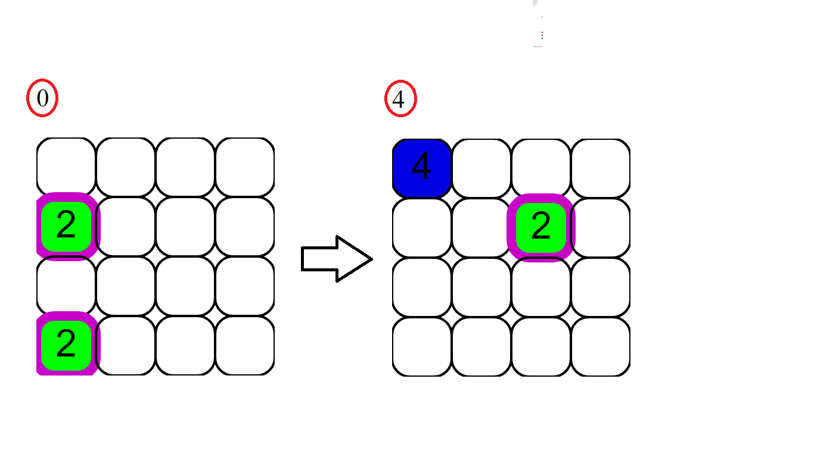

### Samuel Holguin 20161020044
### Andres Ramirez 20161020077
### Kevin Rocha 20161020086
# 2048
2048 es jugado en una cuadrícula simple de 4x4 con baldosas de distintos colores y con un número en su centro. Se utilizan las teclas de dirección izquierda, derecha, arriba y abajo para mover las baldosas, las cuales se deslizan en su totalidad por el tablero. Si dos baldosas con el mismo número "colisionan" durante un movimiento, se combinarán en una nueva baldosa, cuyo número será el equivalente a la suma de los números de las dos baldosas originales (es decir, si dos baldosas con el número 4 colisionan, se combinarán en una baldosa con el número 8). Sin embargo, la baldosa resultante no podrá combinarse con otra baldosa nuevamente en una misma jugada. Después de realizar una jugada, aparecerá una baldosa nueva en un lugar vacío del tablero, la cual tendrá o bien el número 2(90%) o el número 4(10%).
## Puntaje
El juego registra el puntaje del usuario con un marcador en el margen superior izquierdo. El puntaje comienza en cero y, cuando dos baldosas se combinan, este se incrementa por el valor de la baldosa resultante, la variable de puntuación se encuentra en la interfaz y se va cabiando en la funcion updateCanvas.

### Definición GeneralSección
JavaScript es un lenguaje de programación que te permite realizar actividades complejas en una página web —  cada vez más una página web hace más cosas que sólo mostrar información estática — como mostrar actualizaciones de contenido en el momento, interactuar con mapas, animaciones gráficas 2D/3D etc. — puedes estar seguro que JavaScript está involucrado. Es la tercera capa del pastel de los estándares en las tecnologías para la web, dos de las cuales son (HTML y CSS), hablaremos de ellas más adelante con más detalle en otra parte de nuestra Área de Aprendizaje.

#### HTML
es un lenguaje de marcado que usa la estructura para dar un sentido al contenido web, por ejemplo define párrafos, cabeceras, tablas, imágenes y vídeos en la página.
#### CSS
es un lenguaje de reglas en cascada que usamos para aplicar un estilo a nuestro contenido en HTML, por ejemplo colocando colores de fondo, fuentes y marginando nuestro contenido en múltiples columnas.
#### JavaScript
Es un lenguaje de programación que te permite crear contenido nuevo y dinámico, controlar archivos de multimedia, crear imágenes animadas y muchas otras cosas más. (Aunque, no todo, pero es increíble lo que puedes llegar a hacer con tan sólo unas pocas líneas de código de JavaScript). 
